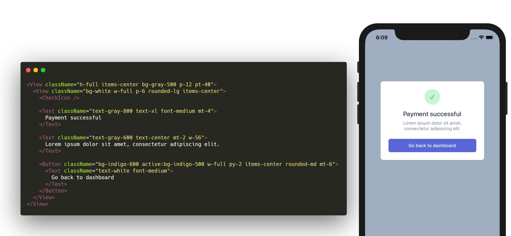

# tailwind-rn-gust 🍃

**className support for tailwind-rn; brings tailwind class names to React Native**

**gust** (tailwind-rn-gust, MIT) is a wrapper around [Vadim Demedes' tailwind-rn library](https://github.com/vadimdemedes/tailwind-rn) to offer enhanced functionality found in more common CSS-in-JS libraries such as component generation plus the ability to translate the `className` prop to the `style` prop in React Native.

All styles are generated from Tailwind CSS source and not hard-coded, which makes it easy to keep this & tailwind-rn up to date with the latest changes and fixes in Tailwind CSS itself.

`yarn install tailwind-rn-gust tailwind-rn` or `npm install tailwind-rn-gust tailwind-rn`



## Pitch

```jsx
import React, { useMemo } from "react";
import { gust, useEvent } from "tailwind";

const MyNewComponent = gust(MyComponent, null, (props) => {
  const [active, activeListeners] = useEvent(["onFocus", "onBlur"], props);
  const result = useMemo(
    () => [{ active, focus: active }, { ...activeListeners }],
    [active, activeListeners]
  );
  return result;
});

const FunctionalComponent = () => {
  return <MyNewComponent className="bg-blue-500 active:bg-red-500" />;
};
```

One of tailwind-rn's main goals is to offer a function for accessing the tailwind CSS classes via JavaScript. This allows the library to update frequently without introducing breaking changes. As a result, pseudo classes and the use of the `className` prop are [explicitly out of scope](https://github.com/vadimdemedes/tailwind-rn/issues/2).

The most common use of gust is to create a higher order component that translates `className` to `style` using tailwind-rn and can enable/disable flags to emulate the pseudo states found in a typical browser environment. By frontloading this work, you greatly simplify the cognitive load for tracking state management and mapping it to tailwind's pseudo classes. By offering **no default components**, gust keeps out of your way until you need it or the augmented `tailwind` / `getColor` functions from tailwind-rn.

I believe that adding flags to enable/disable tailwind features allows us to expose more of tailwind's surface area in an environment where tailwind's selctor syntax must be emulated. Breakpoints, active/hover, color schemes, and more can be reasoned about in your codebase where you likely already have patterns, providers, or hooks for these problems. Because there is so much variety in the React Native ecosystem, the only way to create something broadly applicable is to keep it simple.

## Anti-Pitch

The additional indirection will add confusion. Because gust only filters the className prop down to the active set of styles, it will become more difficult to identify if your problem is in your React Native code, in gust, or in tailwind-rn. The most common example I can think of is the [`dotenv` ecosystem](https://www.npmjs.com/search?q=keywords:dotenv), where you end up with several nested function calls & order matters. While the process of using tailwind-rn to create a local `tailwind()` instance will make it difficult to accidentally import the wrong tailwind, the additional use of flags is not covered in the tailwind-rn docs, resulting in documentaion being scattered in multiple places.

To remediate that, this README included the most relevant information from tailwind-rn in this document and happily takes PRs with documentation or links in order to minimize this frustration.

Another good reason to avoid gust is that you may not need it. If you are using `TouchableOpacity` or `TouchableHighlight` you probably don't care about active/hover/focus states since those are already handled for you. If you are using the new [Pressable API](https://reactnative.dev/docs/pressable), then the `pressed` state is made available to you in a functional child. If you're using react-native-web, the pressable state works as expected there as well.

```jsx
<Pressable>{({pressed}) => (
  <View style={tailwind(`bg-blue-500 ${pressed ? "bg-red-500" : ""}`)}>
)}
```

Unless you are needing a specific gust feature supported by a flagging system (such as `dark:` or `md:`), you should use `tailwind-rn` directly.

Finally, this library is still very immature. It works for a very specific use case and I've removed a good number of "cool" features that you'd probably like to see. I'd rather this library be **very good at few things** than mediocre at a lot of items.

# Getting Started

First, you'll need gust and tailwind-rn

`yarn install tailwind-rn-gust tailwind-rn` or `npm install tailwind-rn-gust tailwind-rn`

Then, you'll need to create a custom tailwind configuration. (These steps are from the [tailwind-rn README](https://github.com/vadimdemedes/tailwind-rn/blob/master/readme.md))

1. run `npx tailwindcss init` to create a `tailwind.config.js` file in your project root
2. run `npx create-tailwind-rn` or `yarn create-tailwind-rn` to generate a `styles.json` containing a JS-friendly representation of your tailwind files
3. create a `tailwind.js` file which uses tailwind-rn's `create` function and gust's `wrap` function to create a custom `tailwind()`, `getColor()` and `gust()` function in addition to the regular tailwind-rn output.

```js
import { create } from "tailwind-rn";
import wrap, { useEvent } from "tailwind-rn-gust";
import styles from "./styles.json";

const { tailwind, getColor, gust } = wrap(create(styles));
export { tailwind, getColor, gust, useEvent };
```

(optionally) you can create an [alias](https://medium.com/@sterlingcobb/adding-alias-to-create-react-native-app-crna-in-2-minutes-45574f4a7729) so that you can just do `import {tailwind, getColor, gust} from "tailwind"` anywhere in your code and not worry about paths. You may also wish to expose `useEvent` in this way for consistency per the example.

# API (🍃 = Unique to gust)

The following functions are exposed as a result of calling `wrap()` around a tailwind-rn result object. Anything not listed here is the original tailwind-rn result.

## tailwind(classNames, flags)

`import {tailwind} from "tailwind"`

| param      | type     | description                                                            |
| :--------- | :------- | :--------------------------------------------------------------------- |
| classNames | `string` | A list of tailwind classes you want to generate styles for             |
| flags      | `Object` | 🍃 A hash map of enabled tailwind pseudo elements, only checked if set |

_returns_ An `Object` containing CSS styles that can be used in the `style` prop of a React Native component

## getColor(color)

`import {getColor} from "tailwind"`

| param | type     | description                                                                                             |
| :---- | :------- | :------------------------------------------------------------------------------------------------------ |
| color | `string` | An opacity class from tailwind and one or more background color strings with the `bg-` prefixes removed |
| flags | `Object` | 🍃 A hash map of enabled tailwind pseudo elements, only checked when set                                |

_returns_ A `string` containing the hex or `rgba` color value.

## flags: {} 🍃

Flags are gust's way of enabling and disabling tailwind pseudo elements such as `active:`, `hover:`, `md:`, and more. gust has no opinion on how these flags are generated, though I'd recommend memoizing complex flags. If your flags are coming from other React hooks, the key bits are likely already memoized for you.

When calculating flags, your tailwind class names are split on a colon `:` and then the psuedo selectors are checked against the `flag` objects. If all flags match, the tailwind class is included in the final output. The class list is sorted so that higher specificity items occur later in the class declaration. For example, `dark:hover:bg-red-500` will be moved after `hover:bg-red-500` as a rough approximation of pseudo selector behavior in the browser.

## useEvent([eventIn, eventOut], props) 🍃

`import {useEvent} from "tailwind-rn-gust"`

| param    | type     | description                                |
| :------- | :------- | :----------------------------------------- |
| eventIn  | `string` | The event that will trigger the "on" state |
| eventOut | `string` | The event that will trigger to "of" state  |
| props    | `Object` | The props object                           |

_returns_ A memoized Array containing `[enabled, listeners]` where `enabled` is a Boolean representing the on/off state of the event and `listeners` is spreadable object that adds listeners to your component. Conflicting listeners are wrapped so that functions are called as expected.

```jsx
const Component = ({ children, ...rest }) => {
  const [active, activeListeners] = useEvent(["onPressIn", "onPressOut"], rest);
  // active is true during onPressIn and false when onPressOut fires
  return (
    <Pressable {...rest} {...activeListeners}>
      {children}
    </Pressable>
  );
};
```

The **useEvent** hook makes it easy to attach in/out listeners and manage the corresponding on/off state in a component. The most common use case for this hook is to emulate normal browser behaviors for hover, focus, and active; things not easily exposed in React Native.

This hook can also be used for generating `flags: {}` used in `tailwind` and `getColor`, or called from `useConditionGenerator` inside of `gust()`.

## gust(Component, defaultClassNames, useConditionGenerator) 🍃

| param                 | type              | description                                                                                                                                                                                                                                                                                                                                                                                                                                                          |
| :-------------------- | :---------------- | :------------------------------------------------------------------------------------------------------------------------------------------------------------------------------------------------------------------------------------------------------------------------------------------------------------------------------------------------------------------------------------------------------------------------------------------------------------------- |
| Component             | `React.Component` | A component that can receive the `style` prop to create styles                                                                                                                                                                                                                                                                                                                                                                                                       |
| defaultClassNames     | `string`          | (optional) A string of default class names that will be at the front of all components                                                                                                                                                                                                                                                                                                                                                                               |
| useConditionGenerator | `function(props)` | (optional, **must abide by the [rules of hooks](https://reactjs.org/docs/hooks-rules.html)**) A custom hook that receives the components props in order to add/replace listeners and generate conditions. Expected to return an array of `[conditions, listeners]` where `conditions` is a set of `flags: {}` and `listeners` is an Object containing one or more props to be spread onto the Component. I'd recommend memoizing the result for performance reasons. |

Similar to how `styled` and other CSS-in-JS libraries work, `gust()` allows you to wrap a component to manage the translation of `className` to `style`. The two additional properties, `defaultClassNames` and `conditionGenerator` are completely optional, but can be important in simplifying code.

```js
import { useMemo } from "react";
import { gust } from "tailwind";
import { useEvent } from "tailwind-rn-gust";

const MyNewComponent = gust(MyComponent, "text-red-200", (props) => {
  // REMINDER: You must conform to the "Rules of Hooks"
  // https://reactjs.org/docs/hooks-rules.html
  const [active, activeListeners] = useEvent(["onFocus", "onBlur"], props);
  const result = useMemo(
    () => [{ active, focus: active }, { ...activeListeners }],
    [active, activeListeners]
  );
  return result;
});
```

In the above example, `MyComponent` is wrapped up in `gust()` with the following configuration

- The `defaultClassName` string contains `text-red-200` which will be prepended to every className call on `MyNewComponent`
- The `conditionGenerator` uses gust's `useEvent` hook to trigger an active state during `onFocus/onBlur`
- The collection of `conditions` and `listeners` is wrapped in a `useMemo` call that only updates if either the listeners change or the conditions

We're not restricted to gust's `useEvent` hook either. `useColorScheme` (react-native) can be used for generating the `dark` prefix and your own `useDimensions` hook can be used for generating breakpoint-aware flags. Just make sure that if the condition depends on an event in your component, you're passing that listener into the `[conditions, listeners]` result pair.

# Tests

This library does not have tests yet.

It is 1.0.0+ because the API is pretty stable at this point and we'd like to clearly communicate breaking changes to `wrap` (default export), `gust`, `useEvent`, or changes to the underlying `tailwind` and `getColor` functions.

# Types

Currently typing information is exposed via JS Doc Comments. PRs are welcome from people well-versed in Generics, Intersections, or other appropriate typings.

# License, Credits

- MIT Licensed
- Original ideal from [Matt Apperson](https://github.com/vadimdemedes/tailwind-rn/issues/19)
